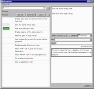

# About

WhaddaDoo is a personal to-do list tool.

- It is freeware.
- It is entirely local and works offline.
- Inspired by Agile practices, it aims to help with prioritization in the first place. Its main purpose is to answer the question, "What should I do now?"

# Caution!

This is an alpha version. It's not supposed to be stable, or to work correctly, and it definitely **is NOT foolproof**.
 

# Requirements

WhaddaDoo requires the following software to be installed on your machine:

- [Python 3.8](https://python.org)
- [wxPython 4.1.1](https://wxpython.org/)
- [PyYAML 6.0](https://pyyaml.org/)

It might work on older versions of these products, but it has not been tested with the older versions. Before reporting a bug, make sure you have the versions listed above or newer versions of these packages.

# Installation

Technically, WhaddaDoo itself doesn't require any special installation. You can download it to a folder on your PC or a thumb drive and run WhaddaDoo.pyw from there - it will work, provided that you have all the prerequisites installed.

Here's how you would install it on a Windows machine:

1. Install Python from https://python.org
1. Open Windows command line.
1. Using **pip**, install wxPython and PyYAML. If you chose not to add Python to the environment variables, you might need to navigate to pip's location first (typically in the Scripts sub-folder in Python's install location).

        pip install -U wxpython pyyaml

1. On the [WhaddaDoo page at GitHub](https://github.com/v-ein/WhaddaDoo), click the 'Releases' link and download the source code for the latest release.
1. Extract it and run WhaddaDoo.pyw.

That's it!

**Note:** On startup, WhaddaDoo searches for a sub-directory in **the current directory** that has the tasks.yaml file inside. Delete the **test-board** sub-directory if you want to start from scratch - or, alternatively, start WhaddaDoo with a different working directory.

# Development

## DISCLAIMER

When I was starting this project, I had very little Python experience and absolutely no wxPython/wxWidgets knowledge. Even though I try to do my best and improve the code as I learn, it might still look weird here and there.

## Naming conventions

You might have noticed that wxPython does not adhere to PEP 8 naming conventions, at least for method names. This is because it's a wrapper around wxWidgets, which is a C++ library.

Within my subclasses of wxPython classes, I use the same naming convention as in wxPython/wxWidgets - CamelCase method names and all. Otherwise such classes would quickly become a horrible mess of different styles.

For 'pure' Python classes, however, I prefer to use the naming recommended in PEP 8. This might look like an unwise mix of rules in a single project; however, I do have my reasons: you can't avoid PEP 8 names because **all other** libraries, including Python itself, use them. Therefore I try to minimize the area where non-PEP 8 names live.

## Python version

I have reasons to stick to Python 3.8. There are places in the code that could look more elegant with a newer version of Python; however, for now I'm keeping the code compatible with 3.8. This may change in future.

## How to contribute

This is yet to be defined. If you're interested in working on this project, please let me know via email or GitHub, and we'll find a way to do that.

## Bugs

Before reporting any bugs, please check [the list of known issues](KnownIssues.md).

# License

This project is licensed under the terms of the MIT license. For full license terms, please refer to the file [LICENSE](../LICENSE).